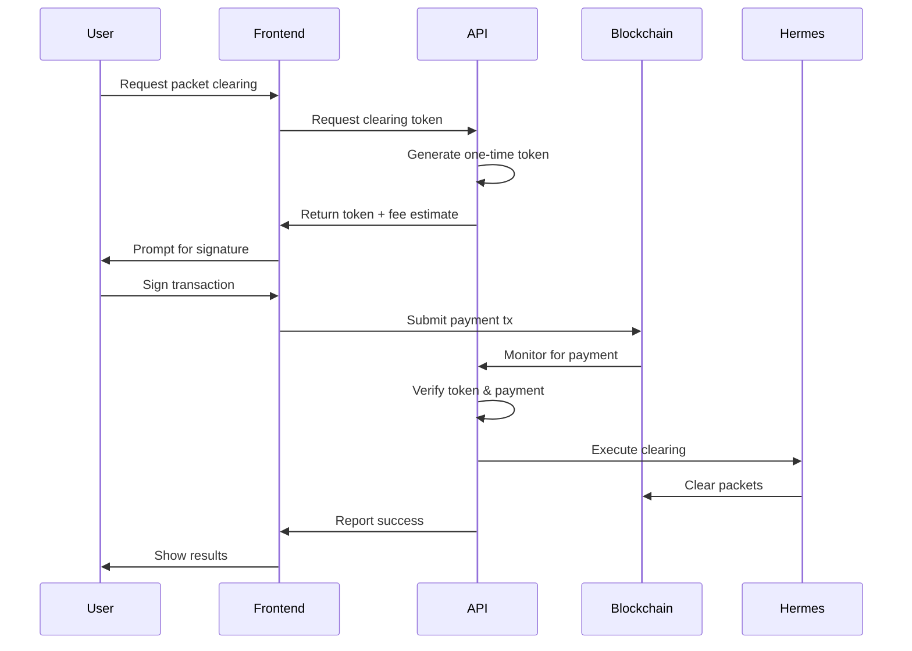

# Packet Clearing Architecture

## Overview

This document describes a secure packet clearing system where users can request IBC packet clearing through our centralized relayer service. The system uses cryptographic signatures and one-time tokens to ensure security while providing a seamless user experience.

## Core Architecture

### 1. Token-Based Authorization Flow



### 2. Data Structures

#### Clearing Request Token
```typescript
interface ClearingToken {
  // Token identity
  token: string // UUID v4
  version: number // Token format version
  
  // Request details
  requestType: 'packet' | 'channel' | 'bulk'
  targetIdentifiers: {
    packets?: Array<{
      chain: string
      channel: string
      sequence: number
    }>
    channels?: Array<{
      srcChain: string
      dstChain: string
      srcChannel: string
      dstChannel: string
    }>
  }
  
  // Authorization
  walletAddress: string
  chainId: string
  
  // Validity
  issuedAt: number // Unix timestamp
  expiresAt: number // Unix timestamp (usually +5 minutes)
  
  // Pricing
  serviceFee: string // Amount in smallest denomination
  estimatedGasFee: string
  totalRequired: string
  acceptedDenom: string
  
  // Security
  nonce: string // Prevent replay attacks
  signature: string // Backend signature of token data
}
```

#### Payment Transaction Format
```typescript
interface PaymentMemo {
  v: 1 // Version
  t: string // Token (abbreviated for space)
  a: string // Action: 'clear_packet' | 'clear_channel'
  d: { // Data
    p?: number[] // Packet sequences
    c?: string // Channel ID
  }
}

// Example memo (compressed):
// {"v":1,"t":"a7f3...8d2c","a":"clear_packet","d":{"p":[12345,12346]}}
```

### 3. Database Schema

```sql
-- One-time tokens
CREATE TABLE clearing_tokens (
    token TEXT PRIMARY KEY,
    wallet_address TEXT NOT NULL,
    chain_id TEXT NOT NULL,
    request_type TEXT NOT NULL,
    target_data TEXT NOT NULL, -- JSON with packets/channels
    
    -- Token lifecycle
    issued_at TIMESTAMP NOT NULL,
    expires_at TIMESTAMP NOT NULL,
    used_at TIMESTAMP,
    
    -- Pricing
    service_fee TEXT NOT NULL,
    estimated_gas_fee TEXT NOT NULL,
    total_required TEXT NOT NULL,
    accepted_denom TEXT NOT NULL,
    
    -- Payment tracking
    payment_tx_hash TEXT,
    payment_received_at TIMESTAMP,
    payment_amount TEXT,
    payment_verified BOOLEAN DEFAULT FALSE,
    
    -- Execution tracking
    execution_started_at TIMESTAMP,
    execution_completed_at TIMESTAMP,
    execution_status TEXT, -- 'pending', 'executing', 'success', 'failed'
    execution_tx_hashes TEXT, -- JSON array
    
    INDEX idx_tokens_wallet (wallet_address),
    INDEX idx_tokens_expires (expires_at),
    INDEX idx_tokens_payment (payment_tx_hash)
);

-- Clearing operations log
CREATE TABLE clearing_operations (
    id INTEGER PRIMARY KEY AUTOINCREMENT,
    token TEXT NOT NULL,
    wallet_address TEXT NOT NULL,
    
    -- Operation details
    operation_type TEXT NOT NULL,
    packets_targeted INTEGER NOT NULL,
    packets_cleared INTEGER NOT NULL,
    packets_failed INTEGER NOT NULL,
    
    -- Execution details
    started_at TIMESTAMP NOT NULL,
    completed_at TIMESTAMP,
    duration_ms INTEGER,
    
    -- Results
    success BOOLEAN NOT NULL,
    error_message TEXT,
    gas_used TEXT,
    actual_fee_paid TEXT,
    
    -- Transaction references
    payment_tx_hash TEXT NOT NULL,
    execution_tx_hashes TEXT NOT NULL, -- JSON array
    
    FOREIGN KEY (token) REFERENCES clearing_tokens(token),
    INDEX idx_ops_wallet (wallet_address),
    INDEX idx_ops_timestamp (started_at)
);

-- Detailed packet clearing results
CREATE TABLE packet_clearing_results (
    id INTEGER PRIMARY KEY AUTOINCREMENT,
    operation_id INTEGER NOT NULL,
    
    -- Packet identity
    chain_id TEXT NOT NULL,
    channel TEXT NOT NULL,
    sequence INTEGER NOT NULL,
    
    -- Result
    cleared BOOLEAN NOT NULL,
    tx_hash TEXT,
    error TEXT,
    gas_used INTEGER,
    
    -- Timing
    attempted_at TIMESTAMP NOT NULL,
    confirmed_at TIMESTAMP,
    
    FOREIGN KEY (operation_id) REFERENCES clearing_operations(id),
    INDEX idx_results_operation (operation_id)
);

-- User statistics
CREATE TABLE user_statistics (
    wallet_address TEXT PRIMARY KEY,
    chain_id TEXT NOT NULL,
    
    -- Cumulative stats
    total_requests INTEGER DEFAULT 0,
    successful_clears INTEGER DEFAULT 0,
    failed_clears INTEGER DEFAULT 0,
    total_packets_cleared INTEGER DEFAULT 0,
    total_fees_paid TEXT DEFAULT '0',
    total_gas_saved TEXT DEFAULT '0',
    
    -- Time-based stats
    first_request_at TIMESTAMP,
    last_request_at TIMESTAMP,
    most_active_hour INTEGER, -- 0-23
    most_active_day INTEGER, -- 0-6
    
    -- Performance stats
    avg_clear_time_ms INTEGER,
    success_rate REAL,
    preferred_channels TEXT, -- JSON array
    
    updated_at TIMESTAMP DEFAULT CURRENT_TIMESTAMP
);

-- Authentication logs for data access
CREATE TABLE auth_logs (
    id INTEGER PRIMARY KEY AUTOINCREMENT,
    wallet_address TEXT NOT NULL,
    
    -- Auth details
    message_signed TEXT NOT NULL,
    signature TEXT NOT NULL,
    verified BOOLEAN NOT NULL,
    
    -- Session info
    session_token TEXT,
    ip_address TEXT,
    user_agent TEXT,
    
    -- Timestamps
    authenticated_at TIMESTAMP NOT NULL,
    expires_at TIMESTAMP,
    
    INDEX idx_auth_wallet (wallet_address),
    INDEX idx_auth_session (session_token)
);
```

## Implementation Details

### 1. Token Generation Service

```typescript
class ClearingTokenService {
  private readonly SECRET_KEY: string
  private readonly TOKEN_VALIDITY_SECONDS = 300 // 5 minutes
  
  async generateToken(request: ClearingRequest): Promise<ClearingToken> {
    // Validate request
    await this.validateRequest(request)
    
    // Calculate fees
    const fees = await this.calculateFees(request)
    
    // Generate token
    const token: ClearingToken = {
      token: uuidv4(),
      version: 1,
      requestType: request.type,
      targetIdentifiers: request.targets,
      walletAddress: request.walletAddress,
      chainId: request.chainId,
      issuedAt: Date.now(),
      expiresAt: Date.now() + (this.TOKEN_VALIDITY_SECONDS * 1000),
      serviceFee: fees.serviceFee,
      estimatedGasFee: fees.gasFee,
      totalRequired: fees.total,
      acceptedDenom: fees.denom,
      nonce: crypto.randomBytes(16).toString('hex'),
      signature: ''
    }
    
    // Sign token
    token.signature = await this.signToken(token)
    
    // Store in database
    await this.storeToken(token)
    
    return token
  }
  
  private async calculateFees(request: ClearingRequest): Promise<Fees> {
    const baseServiceFee = 1000000 // 1 TOKEN
    const perPacketFee = 100000 // 0.1 TOKEN
    
    let packetCount = 0
    if (request.type === 'packet') {
      packetCount = request.targets.packets?.length || 0
    } else if (request.type === 'channel') {
      // Estimate packets in channel
      packetCount = await this.estimateChannelPackets(request.targets.channels)
    }
    
    const serviceFee = baseServiceFee + (packetCount * perPacketFee)
    const gasFee = await this.estimateGasFee(packetCount)
    
    return {
      serviceFee: serviceFee.toString(),
      gasFee: gasFee.toString(),
      total: (serviceFee + gasFee).toString(),
      denom: 'utoken'
    }
  }
}
```

### 2. Payment Verification Service

```typescript
class PaymentVerificationService {
  private readonly MIN_CONFIRMATIONS = 1
  
  async verifyPayment(txHash: string, expectedToken: string): Promise<boolean> {
    // Get transaction from chain
    const tx = await this.queryTransaction(txHash)
    
    // Verify transaction exists and is confirmed
    if (!tx || tx.confirmations < this.MIN_CONFIRMATIONS) {
      return false
    }
    
    // Extract and parse memo
    const memo = this.extractMemo(tx)
    if (!memo || memo.t !== expectedToken) {
      return false
    }
    
    // Verify payment amount
    const token = await this.getToken(expectedToken)
    const paidAmount = this.extractPaymentAmount(tx, token.acceptedDenom)
    
    if (BigInt(paidAmount) < BigInt(token.totalRequired)) {
      return false
    }
    
    // Verify recipient is our service address
    if (!this.verifyRecipient(tx)) {
      return false
    }
    
    // Update token as paid
    await this.markTokenAsPaid(expectedToken, txHash, paidAmount)
    
    return true
  }
  
  private extractMemo(tx: Transaction): PaymentMemo | null {
    try {
      // Find transfer message
      const transferMsg = tx.messages.find(msg => 
        msg.typeUrl === '/cosmos.bank.v1beta1.MsgSend'
      )
      
      if (!transferMsg || !transferMsg.memo) {
        return null
      }
      
      // Parse compressed memo
      return JSON.parse(transferMsg.memo) as PaymentMemo
    } catch (e) {
      return null
    }
  }
}
```

### 3. Clearing Execution Service

```typescript
class ClearingExecutionService {
  private readonly hermes: HermesRelayer
  
  async executeClearingOperation(token: string): Promise<ClearingResult> {
    const tokenData = await this.getVerifiedToken(token)
    
    // Start operation
    const operation = await this.startOperation(tokenData)
    
    try {
      let results: PacketClearResult[]
      
      switch (tokenData.requestType) {
        case 'packet':
          results = await this.clearSpecificPackets(tokenData.targetIdentifiers.packets)
          break
          
        case 'channel':
          results = await this.clearChannel(tokenData.targetIdentifiers.channels[0])
          break
          
        case 'bulk':
          results = await this.clearMultipleChannels(tokenData.targetIdentifiers.channels)
          break
      }
      
      // Record results
      await this.recordResults(operation.id, results)
      
      // Update statistics
      await this.updateUserStatistics(tokenData.walletAddress, results)
      
      return {
        success: true,
        operationId: operation.id,
        packetsCleared: results.filter(r => r.cleared).length,
        packetsFailed: results.filter(r => !r.cleared).length,
        txHashes: results.map(r => r.txHash).filter(Boolean)
      }
      
    } catch (error) {
      await this.recordOperationError(operation.id, error)
      throw error
    }
  }
  
  private async clearSpecificPackets(packets: PacketIdentifier[]): Promise<PacketClearResult[]> {
    const results: PacketClearResult[] = []
    
    // Group packets by channel for efficiency
    const packetsByChannel = this.groupPacketsByChannel(packets)
    
    for (const [channelKey, channelPackets] of packetsByChannel) {
      try {
        // Execute clearing through Hermes
        const txHash = await this.hermes.clearPackets({
          srcChain: channelPackets[0].chain,
          srcChannel: channelPackets[0].channel,
          sequences: channelPackets.map(p => p.sequence)
        })
        
        // Mark all packets as cleared
        for (const packet of channelPackets) {
          results.push({
            ...packet,
            cleared: true,
            txHash,
            error: null
          })
        }
      } catch (error) {
        // Mark packets as failed
        for (const packet of channelPackets) {
          results.push({
            ...packet,
            cleared: false,
            txHash: null,
            error: error.message
          })
        }
      }
    }
    
    return results
  }
}
```

### 4. User Authentication Service

```typescript
class UserAuthenticationService {
  async authenticateUser(walletAddress: string, signature: string): Promise<string> {
    // Create message to sign
    const message = this.createAuthMessage(walletAddress)
    
    // Verify signature
    const isValid = await this.verifySignature(walletAddress, message, signature)
    
    if (!isValid) {
      throw new Error('Invalid signature')
    }
    
    // Generate session token
    const sessionToken = this.generateSessionToken()
    
    // Store session
    await this.storeSession({
      walletAddress,
      sessionToken,
      message,
      signature,
      expiresAt: Date.now() + (24 * 60 * 60 * 1000) // 24 hours
    })
    
    return sessionToken
  }
  
  private createAuthMessage(walletAddress: string): string {
    const timestamp = Date.now()
    const nonce = crypto.randomBytes(16).toString('hex')
    
    return `Relayooor Authentication Request\n\n` +
           `Wallet: ${walletAddress}\n` +
           `Timestamp: ${timestamp}\n` +
           `Nonce: ${nonce}\n\n` +
           `By signing this message, you authorize Relayooor to access your packet clearing history.`
  }
}
```

## API Endpoints

### 1. Request Clearing Token

```typescript
POST /api/v1/clearing/request-token
Body: {
  walletAddress: string
  chainId: string
  type: 'packet' | 'channel' | 'bulk'
  targets: {
    packets?: Array<{
      chain: string
      channel: string
      sequence: number
    }>
    channels?: Array<{
      srcChain: string
      dstChain: string
      srcChannel: string
      dstChannel: string
    }>
  }
}

Response: {
  token: string
  expiresAt: number
  fees: {
    service: string
    gas: string
    total: string
    denom: string
  }
  paymentAddress: string
  memo: string // Pre-formatted memo for transaction
}
```

### 2. Verify Payment

```typescript
POST /api/v1/clearing/verify-payment
Body: {
  token: string
  txHash: string
}

Response: {
  verified: boolean
  status: 'pending' | 'verified' | 'insufficient' | 'invalid'
  message?: string
}
```

### 3. Get Clearing Status

```typescript
GET /api/v1/clearing/status/{token}

Response: {
  token: string
  status: 'pending' | 'paid' | 'executing' | 'completed' | 'failed'
  payment: {
    received: boolean
    txHash?: string
    amount?: string
  }
  execution?: {
    startedAt?: string
    completedAt?: string
    packetsCleared?: number
    packetsFailed?: number
    txHashes?: string[]
    error?: string
  }
}
```

### 4. User Authentication

```typescript
POST /api/v1/auth/sign-in
Body: {
  walletAddress: string
  signature: string
  message: string
}

Response: {
  sessionToken: string
  expiresAt: number
}
```

### 5. Get User Statistics

```typescript
GET /api/v1/users/statistics
Headers: {
  Authorization: Bearer {sessionToken}
}

Response: {
  wallet: string
  stats: {
    totalRequests: number
    successfulClears: number
    failedClears: number
    totalPacketsCleared: number
    totalFeesPaid: string
    totalGasSaved: string
    successRate: number
    avgClearTime: number
    mostActiveChannels: Array<{
      channel: string
      count: number
    }>
  }
  history: Array<{
    timestamp: string
    type: string
    packetsCleared: number
    fee: string
    txHashes: string[]
  }>
}
```

### 6. Get Platform Statistics

```typescript
GET /api/v1/statistics/platform

Response: {
  global: {
    totalPacketsCleared: number
    totalUsers: number
    totalFeesCollected: string
    avgClearTime: number
    successRate: number
  }
  daily: {
    packetsCleared: number
    activeUsers: number
    feesCollected: string
  }
  topChannels: Array<{
    channel: string
    packetsCleared: number
    avgClearTime: number
  }>
  peakHours: Array<{
    hour: number
    activity: number
  }>
}
```

## Security Considerations

### 1. Token Security
- One-time use only
- Short expiration (5 minutes)
- Cryptographically signed by backend
- Contains nonce to prevent replay attacks

### 2. Payment Verification
- Minimum confirmation requirements
- Exact amount verification
- Recipient address validation
- Memo format validation

### 3. Rate Limiting
- Per-wallet request limits
- Global throughput limits
- Progressive delays for repeated failures

### 4. Monitoring
- Real-time alerting for suspicious activity
- Automated circuit breakers
- Comprehensive audit logging

## Frontend Integration

### 1. React Hook Example

```typescript
function usePacketClearing() {
  const [token, setToken] = useState<ClearingToken | null>(null)
  const [status, setStatus] = useState<ClearingStatus>('idle')
  
  const requestClearing = async (packets: PacketIdentifier[]) => {
    try {
      // Request token
      const response = await api.requestClearingToken({
        walletAddress: wallet.address,
        chainId: wallet.chainId,
        type: 'packet',
        targets: { packets }
      })
      
      setToken(response.token)
      setStatus('awaiting_payment')
      
      // Generate transaction
      const tx = {
        to: response.paymentAddress,
        value: response.fees.total,
        memo: response.memo
      }
      
      // User signs and broadcasts
      const txHash = await wallet.sendTransaction(tx)
      
      // Verify payment
      await api.verifyPayment(response.token.token, txHash)
      setStatus('executing')
      
      // Poll for completion
      const result = await pollForCompletion(response.token.token)
      setStatus('completed')
      
      return result
      
    } catch (error) {
      setStatus('failed')
      throw error
    }
  }
  
  return { requestClearing, status, token }
}
```

### 2. Vue Component Example

```vue
<template>
  <div class="packet-clearing">
    <div v-if="step === 'select'">
      <h3>Select packets to clear</h3>
      <PacketList 
        :packets="stuckPackets" 
        v-model:selected="selectedPackets"
      />
      <button @click="requestToken" :disabled="!selectedPackets.length">
        Continue
      </button>
    </div>
    
    <div v-else-if="step === 'payment'">
      <h3>Payment Required</h3>
      <FeeBreakdown :fees="token.fees" />
      <button @click="makePayment">
        Pay {{ formatAmount(token.fees.total) }}
      </button>
    </div>
    
    <div v-else-if="step === 'executing'">
      <LoadingSpinner />
      <p>Clearing {{ selectedPackets.length }} packets...</p>
    </div>
    
    <div v-else-if="step === 'complete'">
      <SuccessIcon />
      <p>Successfully cleared {{ result.packetsCleared }} packets!</p>
      <TxLinks :hashes="result.txHashes" />
    </div>
  </div>
</template>

<script setup lang="ts">
const step = ref<'select' | 'payment' | 'executing' | 'complete'>('select')
const selectedPackets = ref<PacketIdentifier[]>([])
const token = ref<ClearingToken | null>(null)

async function requestToken() {
  const response = await api.requestClearingToken({
    walletAddress: wallet.value.address,
    chainId: wallet.value.chainId,
    type: 'packet',
    targets: { packets: selectedPackets.value }
  })
  
  token.value = response.token
  step.value = 'payment'
}

async function makePayment() {
  const tx = await wallet.sendTransaction({
    to: token.value.paymentAddress,
    value: token.value.fees.total,
    memo: token.value.memo
  })
  
  await api.verifyPayment(token.value.token, tx.hash)
  step.value = 'executing'
  
  // Start polling
  await pollForCompletion()
}
</script>
```

## Metrics & Analytics

### 1. Key Metrics to Track

```sql
-- Platform health metrics
CREATE VIEW platform_metrics AS
SELECT
  COUNT(DISTINCT wallet_address) as total_users,
  COUNT(*) as total_operations,
  SUM(packets_cleared) as total_packets_cleared,
  AVG(duration_ms) as avg_clear_time_ms,
  SUM(CASE WHEN success = 1 THEN 1 ELSE 0 END) * 100.0 / COUNT(*) as success_rate,
  SUM(actual_fee_paid) as total_fees_collected
FROM clearing_operations
WHERE completed_at > datetime('now', '-30 days');

-- Channel efficiency metrics  
CREATE VIEW channel_metrics AS
SELECT
  channel,
  COUNT(*) as clear_operations,
  SUM(packets_cleared) as total_cleared,
  AVG(packets_cleared * 1.0 / packets_targeted) as efficiency_rate,
  AVG(gas_used) as avg_gas_per_operation
FROM clearing_operations co
JOIN packet_clearing_results pcr ON co.id = pcr.operation_id
GROUP BY channel;

-- User engagement metrics
CREATE VIEW user_engagement AS
SELECT
  strftime('%Y-%m', first_request_at) as cohort,
  COUNT(*) as users,
  AVG(total_requests) as avg_requests_per_user,
  AVG(julianday(last_request_at) - julianday(first_request_at)) as avg_lifetime_days
FROM user_statistics
GROUP BY cohort;
```

### 2. Real-time Monitoring

```typescript
// Prometheus metrics
const metrics = {
  clearingRequestsTotal: new Counter({
    name: 'clearing_requests_total',
    help: 'Total clearing requests',
    labelNames: ['type', 'chain']
  }),
  
  clearingDuration: new Histogram({
    name: 'clearing_duration_seconds',
    help: 'Time to clear packets',
    labelNames: ['type'],
    buckets: [0.1, 0.5, 1, 5, 10, 30, 60]
  }),
  
  packetsCleared: new Counter({
    name: 'packets_cleared_total',
    help: 'Total packets cleared',
    labelNames: ['channel', 'success']
  }),
  
  revenueTotal: new Counter({
    name: 'revenue_total',
    help: 'Total revenue collected',
    labelNames: ['denom']
  })
}
```

## Deployment Considerations

### 1. Service Components

- **API Service**: Handles token generation, payment verification
- **Payment Monitor**: Watches blockchain for payments
- **Clearing Executor**: Manages Hermes relayer operations
- **Statistics Aggregator**: Updates user and platform stats

### 2. High Availability

- Redis for token storage with TTL
- PostgreSQL with read replicas for analytics
- Multiple Hermes instances for redundancy
- Circuit breakers for chain RPC calls

### 3. Scaling Strategy

- Horizontal scaling for API servers
- Queue-based clearing execution
- Batch similar operations together
- Cache frequently accessed data